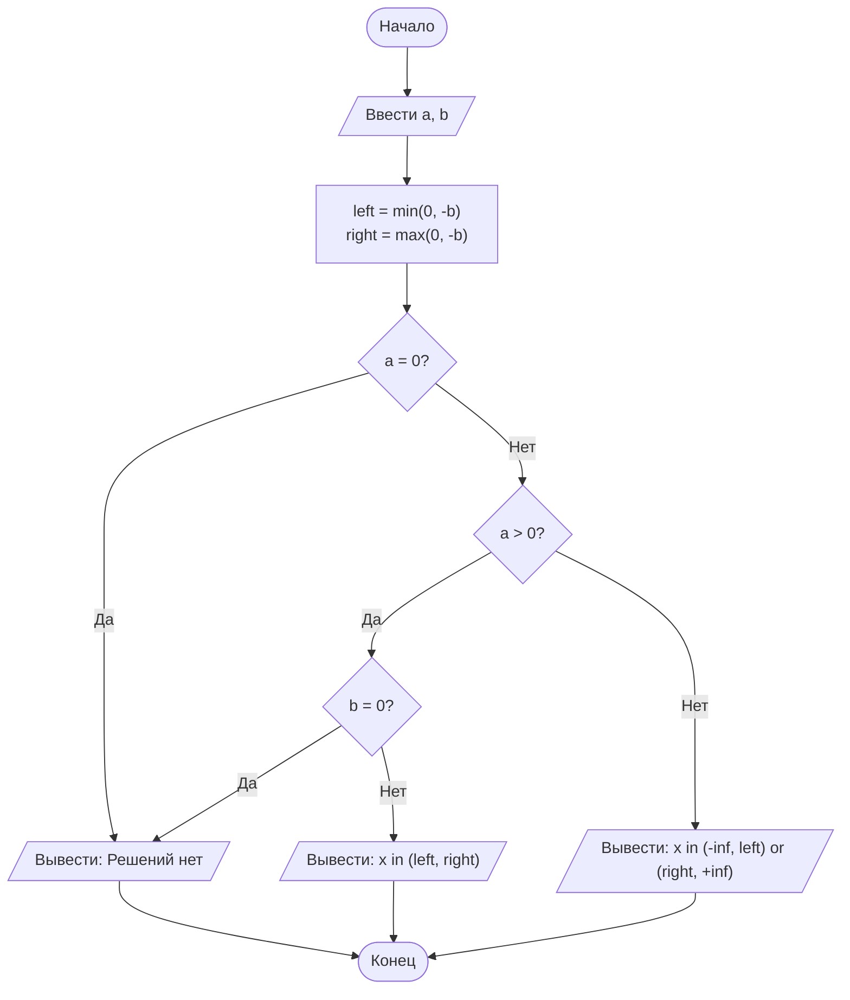

# Отчет по лабораторной работе № 1

#### № группы: `ПМ-2602`

#### Выполнил: `Хисамов Вадим Ринатович`

#### Вариант: `21`

## Содержание

- [1. Постановка задачи](#1-постановка-задачи)
- [2. Входные и выходные данные](#2-входные-и-выходные-данные)
- [2.5. Математическая модель](#25-математическая-модель)
- [3. Выбор структуры данных](#3-выбор-структуры-данных)
- [4. Алгоритм](#4-алгоритм)
- [5. Программа](#5-программа)
- [6. Анализ правильности решения](#6-анализ-правильности-решения)

## 1. Постановка задачи

Дано неравенство:
$$
\[
\frac{a}{x(x+b)} < 0,
\]
$$
где `a` и `b` — вещественные параметры, вводимые с клавиатуры.

Необходимо определить множество значений `x`, при которых неравенство выполняется.

При решении необходимо учитывать точки, в которых знаменатель обращается в ноль:

\[
x = 0,\qquad x = -b.
\]

Эти точки не входят в область допустимых значений выражения.

## 2. Входные и выходные данные

### Входные данные

На вход программе подаются два вещественных числа:

- `a` — числитель дроби;
- `b` — параметр знаменателя.

Для хранения обоих значений используется тип `double`, позволяющий работать с вещественными числами.

Пример входных данных:

```text
Введите a: 2
Введите b: 4
```

### Выходные данные

Результатом работы программы является строка, содержащая множество решений неравенства в виде одного или двух интервалов.

Если решений нет, программа выводит:

```text
Решений нет
```

Пример результата:

```text
x in (-4.0, 0.0)
```

## 2.5. Математическая модель

Рассматривается неравенство

\[
\frac{a}{x(x+b)} < 0.
\]

Знаменатель обращается в ноль в точках

\[
x_1 = 0,
\qquad
x_2 = -b.
\]

Обозначим левую и правую критические точки:

\[
left = \min(0,-b),
\]

\[
right = \max(0,-b).
\]

Далее рассматривается знак параметра `a`.

### Случай 1: `a > 0`

Для выполнения исходного неравенства знаменатель должен быть отрицательным:

\[
x(x+b)<0.
\]

Произведение отрицательно между его корнями, поэтому при `b != 0`:

\[
x \in (left,right).
\]

Если `b = 0`, знаменатель принимает вид

\[
x^2,
\]

который положителен при любом `x != 0`. Поэтому при `a > 0` решений нет.

### Случай 2: `a < 0`

Для выполнения исходного неравенства знаменатель должен быть положительным:

\[
x(x+b)>0.
\]

Это выполняется вне промежутка между корнями:

\[
x \in (-\infty,left)\cup(right,+\infty).
\]

Формула также корректна при `b = 0`. В этом случае:

\[
left=right=0,
\]

и получаем:

\[
x\in(-\infty,0)\cup(0,+\infty).
\]

### Случай 3: `a = 0`

При всех допустимых значениях `x` левая часть равна нулю:

\[
0<0.
\]

Данное утверждение ложно, поэтому решений нет.

## 3. Выбор структуры данных

Для хранения входных параметров `a` и `b`, а также границ интервалов `left` и `right` используется тип `double`, так как значения параметров могут быть вещественными.

Для представления результата используется тип `String`, поскольку ответ необходимо вывести в виде интервала или сообщения об отсутствии решений.

Использование массивов, списков и других коллекций в данной задаче не требуется, так как для решения достаточно хранить два входных параметра и две границы интервалов.

## 4. Алгоритм

Алгоритм работы программы:

1. Ввести значения параметров `a` и `b`.
2. Найти две критические точки знаменателя: `0` и `-b`.
3. Определить левую границу как минимум из `0` и `-b`.
4. Определить правую границу как максимум из `0` и `-b`.
5. Если `a = 0`, сообщить, что решений нет.
6. Если `a > 0`:
   - если `b = 0`, сообщить, что решений нет;
   - иначе вернуть открытый интервал `(left, right)`.
7. Если `a < 0`, вернуть объединение интервалов `(-inf, left)` и `(right, +inf)`.
8. Вывести полученный результат.

### Блок-схема алгоритма



## 5. Программа

```java
import java.util.Scanner;

public class Main {
    public static void main(String[] args){
        Scanner scanner = new Scanner(System.in);
        System.out.print("Введите a : " );
        double a = scanner.nextDouble();
        System.out.print("Введите b : " );
        double b = scanner.nextDouble();
        scanner.close();
        String solution = isSolution(a, b);
        System.out.println(solution);
    }

    public static String isSolution(double a, double b) {
        double left  = Math.min(0, -b);
        double right = Math.max(0, -b);
        if (a > 0) {
            if (b != 0){
                String solution = "x in (" + (left) + ',' + (right) + ')';
                return solution;
            }
            else {
                return "x not exists";
            }
        }
        else if (a == 0) {
            String solution = "x not exists";
            return solution;
        }
        else {
            String solution = "x in (-inf," + (left) + ')' + "or in (" + (right) + ",+inf)";
            return solution;
        }
    }
}
```

## 6. Анализ правильности решения

Для проверки программы необходимо рассмотреть различные знаки параметров `a` и `b`, а также граничные случаи `a = 0` и `b = 0`.

### Тест 1. Положительные `a` и `b`

**Input:**

```text
2
4
```

Критические точки:

\[
-4,\quad 0.
\]

Так как `a > 0`, решение находится между ними.

**Output:**

```text
x in (-4.0, 0.0)
```

Ожидаемый результат получен.

### Тест 2. `a > 0`, `b < 0`

**Input:**

```text
3
-5
```

Критические точки:

\[
0,\quad 5.
\]

**Output:**

```text
x in (0.0, 5.0)
```

Программа правильно определяет порядок критических точек независимо от знака `b`.

### Тест 3. `a < 0`, `b > 0`

**Input:**

```text
-2
4
```

При отрицательном числителе знаменатель должен быть положительным, поэтому выбираются внешние интервалы.

**Output:**

```text
x in (-inf, -4.0) or (0.0, +inf)
```

Результат соответствует математической модели.

### Тест 4. `a < 0`, `b < 0`

**Input:**

```text
-3
-5
```

**Output:**

```text
x in (-inf, 0.0) or (5.0, +inf)
```

Программа корректно работает при отрицательном значении `b`.

### Тест 5. `a = 0`

**Input:**

```text
0
5
```

При `a = 0` левая часть неравенства равна нулю во всех точках области определения. Строгое неравенство `0 < 0` не выполняется.

**Output:**

```text
Решений нет
```

Граничный случай обработан корректно.

### Тест 6. `a > 0`, `b = 0`

**Input:**

```text
5
0
```

Получаем:

\[
\frac{5}{x^2}<0.
\]

При `x != 0` выражение положительно, поэтому решений нет.

**Output:**

```text
Решений нет
```

### Тест 7. `a < 0`, `b = 0`

**Input:**

```text
-5
0
```

Получаем:

\[
\frac{-5}{x^2}<0.
\]

При любом `x != 0` выражение отрицательно.

**Output:**

```text
x in (-inf, 0.0) or (0.0, +inf)
```

Таким образом, программа корректно обрабатывает основные и граничные случаи задачи.
