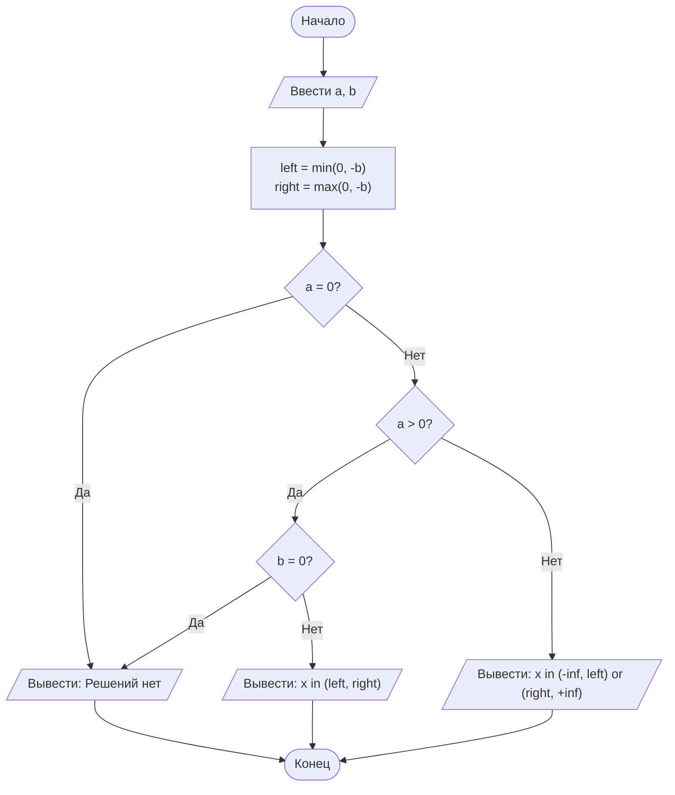

## Отчет по лабораторной работе № 1

#### № группы: `ПМ-2602`

#### Выполнил: `Хисамов Вадим Ринатович`

#### Вариант: `21`

### Содержание:

- [1. Постановка задачи](#1-постановка-задачи)
- [2. Входные и выходные данные](#2-входные-и-выходные-данные)
- [3. Выбор структуры данных](#3-выбор-структуры-данных)
- [4. Алгоритм](#4-алгоритм)
  - [Математическая модель](#математическая-модель)
- [5. Программа](#5-программа)
- [6. Анализ правильности решения](#6-анализ-правильности-решения)

### 1. Постановка задачи

> Дано неравенство:
>
> $\dfrac{a}{x(x+b)} < 0,$
>
> где `a` и `b` — вещественные параметры, вводимые с клавиатуры.
>
> Необходимо определить множество значений `x`, при которых неравенство выполняется.

При решении необходимо учитывать точки, в которых знаменатель обращается в ноль:

$x = 0,\qquad x = -b.$

Эти точки не входят в область допустимых значений выражения.

### 2. Входные и выходные данные

#### Входные данные

На вход программе подаются два вещественных числа:

- `a` — числитель дроби;
- `b` — параметр знаменателя.

Для хранения обоих значений используется тип `double`, позволяющий работать с вещественными числами.

Пример входных данных:

```text
Введите a: 2
Введите b: 4
```

#### Выходные данные

Результатом работы программы является строка, содержащая множество решений неравенства в виде одного или двух интервалов.

Если решений нет, программа выводит:

```text
Решений нет
```

Пример результата:

```text
x in (-4.0, 0.0)
```

### 3. Выбор структуры данных

Для хранения входных параметров `a` и `b`, а также границ интервалов `left` и `right` используется тип `double`, так как значения параметров могут быть вещественными.

|                         | название переменной | Тип (в Java) |
|-------------------------|---------------------|--------------|
| Числитель дроби          | `a`                 | `double`     |
| Параметр знаменателя    | `b`                 | `double`     |
| Левая граница интервала | `left`              | `double`     |
| Правая граница интервала | `right`            | `double`     |
| Результат решения      | `solution`          | `String`     |

`double` — примитивный 64-битный тип для хранения чисел с плавающей точкой двойной точности. Он позволяет представлять положительные и отрицательные числа с дробной частью, но имеет ограниченную точность: некоторые значения сохраняются с округлением. Максимальное конечное значение по модулю — `Double.MAX_VALUE`, приблизительно $1{,}7976931348623157 \cdot 10^{308}$.

Для представления результата используется тип `String`, поскольку ответ необходимо вывести в виде интервала или сообщения об отсутствии решений.

`String` — ссылочный тип (класс) для представления строк текста. Объекты этого класса неизменяемы: после создания содержимое строки не меняется, а при объединении строк формируется новый результат. В данной программе строка содержит границы интервалов и текст ответа, поэтому числовой тип для хранения результата не подходит.

Использование массивов, списков и других коллекций в данной задаче не требуется, так как для решения достаточно хранить два входных параметра и две границы интервалов.

### 4. Алгоритм

#### Математическая модель

Предполагается, что вводимые параметры `a` и `b` являются конечными числами, представимыми типом `double`: их модули не должны превышать `Double.MAX_VALUE`. Это ограничение необходимо для предотвращения переполнения. Для ненулевых значений также следует учитывать нижнюю границу представления: слишком малые по модулю числа могут округлиться до нуля, что изменит рассматриваемый случай. Значения `NaN` и бесконечности исключаются. При этом соблюдение диапазона не гарантирует отсутствия потери точности: из-за ограниченной точности `double` входные значения могут округляться. Далее математическая модель применяется к значениям `a` и `b`, сохранённым после ввода.

Рассматривается неравенство

$\frac{a}{x(x+b)} < 0.$

Знаменатель обращается в ноль в точках

$x_1 = 0,
\qquad
x_2 = -b.$

Обозначим левую и правую критические точки:

$left = \min(0,-b),$

$right = \max(0,-b).$

Далее рассматривается знак параметра `a`.

##### Случай 1: `a > 0`

Для выполнения исходного неравенства знаменатель должен быть отрицательным:

$x(x+b)<0.$

Произведение отрицательно между его корнями, поэтому при `b != 0`:

$x \in (left,right).$

Если `b = 0`, знаменатель принимает вид

$x^2,$

который положителен при любом `x != 0`. Поэтому при `a > 0` решений нет.

##### Случай 2: `a < 0`

Для выполнения исходного неравенства знаменатель должен быть положительным:

$x(x+b)>0.$

Это выполняется вне промежутка между корнями:

$x \in (-\infty,left)\cup(right,+\infty).$

Формула также корректна при `b = 0`. В этом случае:

$left=right=0,$

и получаем:

$x\in(-\infty,0)\cup(0,+\infty).$

##### Случай 3: `a = 0`

При всех допустимых значениях `x` левая часть равна нулю:

$0<0.$

Данное утверждение ложно, поэтому решений нет.

#### Алгоритм выполнения программы:

1. **Ввод данных:**

   Программа считывает два вещественных числа, обозначенные как `a` и `b`.

2. **Определение границ интервалов:**

   Программа находит две критические точки знаменателя: `0` и `-b`. Левая граница `left` определяется как минимум из `0` и `-b`, а правая граница `right` — как максимум из этих значений.

3. **Проверка знака параметра `a`:**
   - Если `a = 0`, программа сообщает, что решений нет.
   - Если `a > 0`, программа проверяет значение параметра `b`. При `b = 0` решений нет; иначе программа возвращает открытый интервал `(left, right)`.
   - Если `a < 0`, программа возвращает объединение интервалов `(-inf, left)` и `(right, +inf)`.

4. **Вывод результата:**

   На экран выводится полученное множество решений в виде интервалов или сообщение об отсутствии решений.

#### Блок-схема алгоритма


```mermaid
flowchart TD
    A([Начало]) --> B[/Ввести a, b/]
    B --> C["left = min(0, -b)<br/>right = max(0, -b)"]
    C --> D{a = 0?}

    D -- Да --> E[/Вывести: Решений нет/]
    D -- Нет --> F{a > 0?}

    F -- Да --> G{b = 0?}
    G -- Да --> E
    G -- Нет --> H[/"Вывести: x in (left, right)"/]

    F -- Нет --> I[/"Вывести: x in (-inf, left) or (right, +inf)"/]

    E --> J([Конец])
    H --> J
    I --> J
```

### 5. Программа

```java
import java.util.Scanner;

public class Main {
    public static void main(String[] args){
        Scanner scanner = new Scanner(System.in);
        System.out.print("Введите a : " );
        double a = scanner.nextDouble();
        System.out.print("Введите b : " );
        double b = scanner.nextDouble();
        scanner.close();
        String solution = isSolution(a, b);
        System.out.println(solution);
    }

    public static String isSolution(double a, double b) {
        double left  = Math.min(0, -b);
        double right = Math.max(0, -b);
        if (a > 0) {
            if (b != 0){
                String solution = "x in (" + (left) + ',' + (right) + ')';
                return solution;
            }
            else {
                return "x not exists";
            }
        }
        else if (a == 0) {
            String solution = "x not exists";
            return solution;
        }
        else {
            String solution = "x in (-inf," + (left) + ')' + "or in (" + (right) + ",+inf)";
            return solution;
        }
    }
}
```

### 6. Анализ правильности решения

Для проверки программы необходимо рассмотреть различные знаки параметров `a` и `b`, а также граничные случаи `a = 0` и `b = 0`.

1. Тест 1. Положительные `a` и `b`

    **Input:**

    ```text
    2
    4
    ```

    Критические точки:

    $-4,\quad 0.$

    Так как `a > 0`, решение находится между ними.

    **Output:**

    ```text
    x in (-4.0, 0.0)
    ```

    Ожидаемый результат получен.

2. Тест 2. `a > 0`, `b < 0`

    **Input:**

    ```text
    3
    -5
    ```

    Критические точки:

    $0,\quad 5.$

    **Output:**

    ```text
    x in (0.0, 5.0)
    ```

    Программа правильно определяет порядок критических точек независимо от знака `b`.

3. Тест 3. `a < 0`, `b > 0`

    **Input:**

    ```text
    -2
    4
    ```

    При отрицательном числителе знаменатель должен быть положительным, поэтому выбираются внешние интервалы.

    **Output:**

    ```text
    x in (-inf, -4.0) or (0.0, +inf)
    ```

    Результат соответствует математической модели.

4. Тест 4. `a < 0`, `b < 0`

    **Input:**

    ```text
    -3
    -5
    ```

    **Output:**

    ```text
    x in (-inf, 0.0) or (5.0, +inf)
    ```

    Программа корректно работает при отрицательном значении `b`.

5. Тест 5. `a = 0`

    **Input:**

    ```text
    0
    5
    ```

    При `a = 0` левая часть неравенства равна нулю во всех точках области определения. Строгое неравенство `0 < 0` не выполняется.

    **Output:**

    ```text
    Решений нет
    ```

    Граничный случай обработан корректно.

6. Тест 6. `a > 0`, `b = 0`

    **Input:**

    ```text
    5
    0
    ```

    Получаем:

    $\frac{5}{x^2}<0.$

    При `x != 0` выражение положительно, поэтому решений нет.

    **Output:**

    ```text
    Решений нет
    ```

7. Тест 7. `a < 0`, `b = 0`

    **Input:**

    ```text
    -5
    0
    ```

    Получаем:

    $\frac{-5}{x^2}<0.$

    При любом `x != 0` выражение отрицательно.

    **Output:**

    ```text
    x in (-inf, 0.0) or (0.0, +inf)
    ```

Таким образом, программа корректно обрабатывает основные и граничные случаи задачи.
